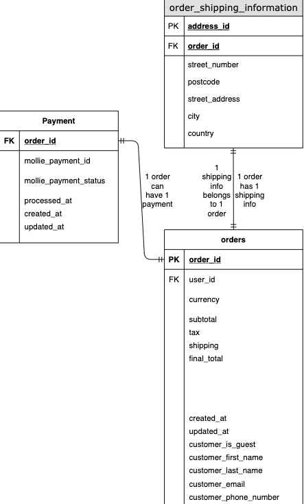
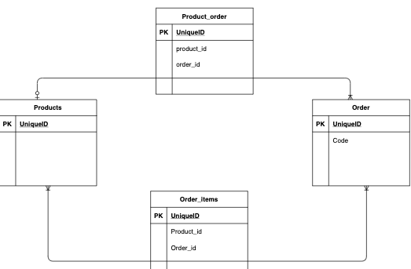
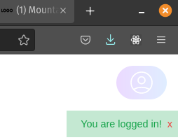

### In this article, I will walk you through my learning points or skills gained from my tasks building this project.

1. ##  Designing and creating relational database with MySQL

   The first task that I tackled was creating a checkout form to collect user’s information before they pay. For this sole process, the table relationships looks like this:

   

   The challenge, now, is how I can integrate this in the already existing database that my colleague made, which only concerns the products and configurations. With this design, there is no clear way how the configurations will be stored when the customers order. So we declared a new many-to-many relationship between the order and the products. Due to the nature of the configurator, there must be a distinction between the original products and the add-on items. Hence, there are product_orders and order_items tables. Essentially products and items are the same thing.

   
2. ## Creating and consuming API 

   For the efficient communication between the front-end and the back-end of this project, I make good use of API. Laravel makes it convenient to do this by using routing, model and controller. In short, one first use migrate to create the shape and properties of their tables. These tables are, then, translated into models for determining relationship and query. After this, one can create API endpoints with Laravel routes. When these endpoints are consumed, the codes are triggered in the designated controller functions, returning meaningful data.

   With this, I managed to: 

   * Create login, registration with magic-link (password-less) and store user’s order in their profile.
   * Store user’s information and order before payment.

   With external API, I can:

   * Allow users to pay with Mollie portal and use their webhook to track and handle payment status changes.
   * User address is automatically filled with only postcode and house number (only in the Netherlands)
3. ## Websocket

   When customers sign in or register, the app will send them an email with magic-link. When the link is clicked, they are logged in and redirected to a confirmation screen. I want the user to get a notification in their original tab when they are logged in, so I use Websocket (Pusher) to allow real-time notification.  

   With the help of Laravel Echo, I can register an event when the user logs in and trigger the notification everytime it happens.

   
4. ## CI/CD and website deployment

   The CI/CD pipeline is made possible with Gitlab and Docker. Gitlab provides a detailed tutorial on how to set up the pipeline for Laravel (PHP). However, it was not an easy endeavor as I got many errors using their scripts. Because my colleagues were all busy, I had to figure things out on my own. This was the first time I have ever deployed a full-stack website from scratch. 

   Thanks to the experience debugging Magento, configurations, server and many more. I could solve them one by one. This whole process took me around 2 weeks for everything to work smoothly. Now the website is up and running. I cannot be prouder.

   ### Again, I am super proud of this project. It took me 1.5 month to build my part and deploy. Even though it’s not perfect yet due to time crunch, the functionalities that we mapped out for an MVP are ready. 

   ### As a result, I am happy to announce that one of our customers will implement this app in the near future.